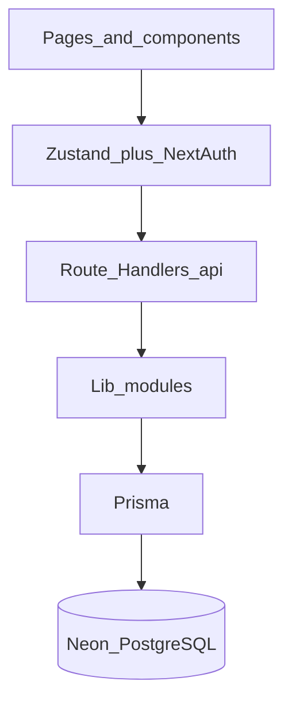
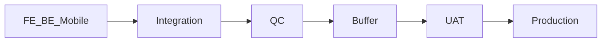
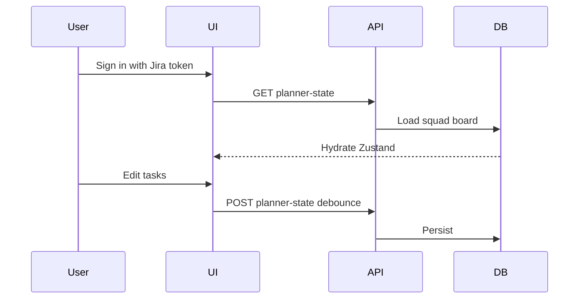

# Sprint Planner

Multi-squad sprint planning for FE / BE / Mobile / Integration / QC / Buffer work, with Estimated vs UAT vs Production dates and optional **Jira Cloud** sync.

**Also see:** [docs/ARCHITECTURE.md](docs/ARCHITECTURE.md) · [docs/USER_GUIDE.md](docs/USER_GUIDE.md) · in-app **Help** at `/docs` after sign-in

---

## Table of contents

1. [Technical runbook](#1-technical-runbook)
2. [Product & domain](#2-product--domain)
3. [User action summary](#3-user-action-summary)

---

## 1. Technical runbook

### How to run

```bash
npm install
cp .env.example .env.local   # fill DATABASE_URL, AUTH_SECRET, AUTH_SUPER_ADMIN_EMAIL, domain gates
npm run prisma:deploy
npm run dev                  # http://localhost:3000
```

| Script | Purpose |
| --- | --- |
| `npm run dev` | Next.js dev server |
| `npm run build` / `npm start` | Production build + serve |
| `npm run prisma:deploy` | Apply migrations |
| `npm run db:seed` | Optional one-time import from `data/*.json` (needs `ALLOW_DB_SEED=1` or `--confirm-seed`) |
| `npm test` / `npm run lint` / `npm run typecheck` | Quality checks |
| git commit | Husky pre-commit runs `npm run build` so Vercel type errors fail locally |

Required env (see [`.env.example`](.env.example)): `DATABASE_URL`, `DIRECT_URL`, `AUTH_SECRET`, `AUTH_SUPER_ADMIN_EMAIL`, email domain gates. Jira **product** settings (site URL, fields, assignee map) live in the DB under **People & Jira → Jira fields** (super admin), not in `.env`.

### Stack & languages

| Layer | Tech |
| --- | --- |
| UI | React 19, Next.js App Router, Tailwind CSS 4 |
| Language | TypeScript |
| Client state | Zustand |
| Auth | NextAuth v5 (Jira email + API token) |
| API | Next.js Route Handlers (`src/app/api/*`) |
| DB | PostgreSQL (Neon) via Prisma |
| Tests | Vitest |

### Request flow



### Folder map

```text
src/app/                 # pages + API routes (/docs Help, dashboard, resources, …)
src/components/          # UI (layout, tasks, docs, timeline, resources, config, sync)
src/store/               # Zustand planner + Jira sync + save status
src/lib/
  access/                # roles, capabilities, registry
  authz/                 # entitlements, permissions, squad storage, Jira tokens
  scheduler/             # schedule engine + calendar
  planner/               # snapshots, Mark Progress meta, paste helpers
  integrations/jira/     # push/pull, fields, assignee map
  history/               # sprint archives
src/auth.ts              # NextAuth
prisma/                  # schema + migrations + seed
docs/                    # ARCHITECTURE.md, USER_GUIDE.md
```

### Error handling

- Unauthenticated pages/APIs → redirect to `/sign-in` or `401` ([src/proxy.ts](src/proxy.ts))
- Forbidden → `403` via `forbidden()` in access helpers
- Auth POST rate limit → `429` with `Retry-After`
- Session revoke when registry access is removed → `SessionRevoked`
- Client save errors surface in the planner save chip

### Database

- **Neon Postgres** holds squads, users, planner tasks/resources/config, Jira config + assignee map, history, encrypted Jira API tokens
- **Session JWT** holds role, allowed squads, squad roles (not planner board data)
- Migrations: `prisma/migrations/`; deploy with `npm run prisma:deploy`

---

## 2. Product & domain

### What it is for

Plan a squad’s sprint board: story hours and assignees by phase, parallel FE/BE (and mobile), then Integration → QC → Buffer, with release dates and optional Jira parent/subtask sync.

### Scheduling logic (short)

1. Working calendar (hours/day, start hour, holidays, biweekly planning Sundays)
2. Parallel FE / BE / Mobile → Integration → QC → Buffer
3. **Estimated** UAT freezes on first valid calc; **UAT/Production** track after **Mark Progress Now**
4. Production = next business day after UAT



### Roles & permissions

| Role | Dashboard / Timeline / History edit | Sprint lifecycle\* | People & Jira / Sprint Settings / User Management |
| --- | --- | --- | --- |
| **Super Admin** | Yes (all squads) | Yes | See + edit |
| **EM** | Yes (own squad) | Yes | See only |
| **Editor** | Yes (own squad) | No | See only |
| **Reviewer** | No | No | See only |

\*Lifecycle = move to next/current sprint, set buffer hours, Mark Progress Now, New Sprint

Editors have no squad switcher; they stay on their assigned squad.

### Tabs

| Tab | Route | Purpose |
| --- | --- | --- |
| Dashboard | `/` | Stories, hours, assignees, status, dates, Jira sync |
| Timeline | `/timeline` | Phase Gantt-style view |
| History | `/history` | Archived sprint snapshots |
| People & Jira | `/resources` | Roster + Jira connection fields |
| Sprint Settings | `/config` | Sprint window, holidays, hours |
| User Management | `/user-management` | Squads & users (squad-scoped for non-admins) |
| Help | `/docs` | In-app documentation |
| (legacy) Jira settings | `/jira-settings` | Redirects to People & Jira |

### Jira pull & push

- **Pull** lists every `[FE]` / `[BE]` / `[Android]` / `[IOS]` child under the parent (`POST /search/jql`). Multiple people on one role keep all assignees; hours are **summed**. A failed child fetch is a warning, not a failed story.
- **Push** writes **one Jira subtask per assignee** and splits hours across them.
- **Pull from Jira** (no row select required) also imports parent stories under this EM that are not on the board (`POST /api/integrations/jira/tasks/discover-em`), using the Engineering Manager field and/or Squad field under **People & Jira → Jira fields**. New rows get tag **`Jira sync`**.
- The pull/push result banner stays short and **scrolls inside** so the task table stays reachable.

### Appearance

The UI follows the laptop **light / dark** setting (`prefers-color-scheme`) so text, cards, and form controls stay readable on dark-mode machines.

### Sync workflow



---

## 3. User action summary

### Everyone
1. Open the app → **Sign in** with work email + Jira API token  
2. Confirm squad (multi-squad users pick one at sign-in)  
3. Use **Help** (`/docs`) for roles and tab overview  

### Reviewer
- Browse Dashboard, Timeline, History, People, Settings, User Management — **view only**

### Editor
- Plan stories on **your squad** (hours, assignees, status, tags, todos, Jira push/pull if eligible)  
- **Cannot**: New Sprint, Mark Progress, buffer hours, move next/current sprint  
- **Can view** People / Settings / User Management  

### EM
- Full planning on your squad **including** Mark Progress, buffer, sprint moves, New Sprint  
- View People / Settings / User Management (no edit)  

### Super Admin
- Everything above on **all** squads  
- Edit People (add from Jira), Sprint Settings, User Management, Jira fields (including Engineering Manager field for EM-story import)  
- User Management: filter the users list by squad  

### User Management (who sees whom)
- **Squad leads / EM / Editor / Reviewer:** the Users list is limited to people on **their squad(s)**  
- **Super Admin:** full registry; optional squad filter on Users

### Typical planning loop
1. Set sprint window (super admin) and roster (super admin)  
2. Add/import stories; assign people and hours  
3. When the plan is ready to lock dates → **Mark Progress Now** (EM / super admin)  
4. Push/pull Jira as needed (pull can import missing EM/squad stories and tags them **Jira sync**)  
5. Archive via History when the sprint closes  

---

## Extra references

- Deep technical notes: [docs/ARCHITECTURE.md](docs/ARCHITECTURE.md)  
- Product workflows: [docs/USER_GUIDE.md](docs/USER_GUIDE.md)  
- Optional handoff notes: [docs/chatgpt-handoff-prompt.md](docs/chatgpt-handoff-prompt.md)  
