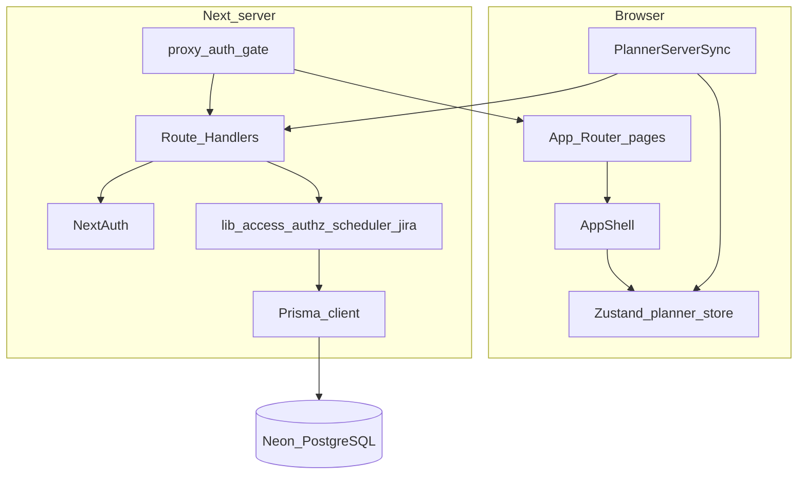

# Architecture

Technical reference for Sprint Planner. For product workflows see [USER_GUIDE.md](USER_GUIDE.md). For a short overview see the [README](../README.md).

## High-level layers



## Auth & access

1. User posts email + Jira API token to credentials provider ([src/auth.ts](../src/auth.ts)).
2. Server verifies against Jira, resolves entitlements ([src/lib/authz/resolveEntitlements.ts](../src/lib/authz/resolveEntitlements.ts)) from local registry and optional identity service.
3. JWT carries `role`, `squadId`, `allowedSquads`, `squadRoles`, `globalAdmin`.
4. UI capabilities from [src/lib/access/control.ts](../src/lib/access/control.ts): `canWrite`, `canManageSprintLifecycle`, `canManageUsers`, `canEditOpsTabs`, `canAccessOpsTabs`, `canViewUserManagement`.
5. APIs use [src/lib/access/server.ts](../src/lib/access/server.ts) (`getSessionAccess`, `canReadFromSession`, `canWriteFromSession`, `resolveRequestedSquadId`).

Registry tables: `Squad`, `User`, `SquadAccount` (writes: super admin only). GET is allowed for EM/editor/reviewer view and **scopes** the payload to the viewer’s squads (`src/lib/access/userManagementScope.ts`).

## Planner sync

1. After sign-in, `PlannerServerSync` loads `GET /api/planner-state` (header `x-squad-id`).
2. Writers debounce-save with `POST /api/planner-state`.
3. Readers poll periodically.
4. Persistence: [src/lib/authz/squadStorage.ts](../src/lib/authz/squadStorage.ts) ↔ Prisma models (`Task`, `Resource`, `SprintConfig`, `PlannerMeta`, …).

## Scheduler

- Engine: [src/lib/scheduler/engine.ts](../src/lib/scheduler/engine.ts)
- Calendar / holidays: [src/lib/scheduler/calendar.ts](../src/lib/scheduler/calendar.ts)
- Remaining effort / replan: [src/lib/scheduler/remainingEffort.ts](../src/lib/scheduler/remainingEffort.ts)
- Mark Progress meta: [src/lib/planner/plannerMeta.ts](../src/lib/planner/plannerMeta.ts), [src/lib/planner/scheduleSnapshot.ts](../src/lib/planner/scheduleSnapshot.ts)

Phase order: FE/BE/Mobile (parallel) → Integration → QC → Buffer → UAT → Production.

## Jira integration

- Config + assignee map in DB (`SquadJiraConfig`, `JiraAssigneeMap`)
- Personal API token encrypted in `JiraAccount`
- Push/pull under `src/app/api/integrations/jira/*` and `src/lib/integrations/jira/*`
- Child listing uses paginated `POST /search/jql` so every `[FE]/[BE]/[Android]/[IOS]` subtask is kept
- Missing EM/squad parents: `POST /api/integrations/jira/tasks/discover-em` (`engineeringManagerFieldId` on `SquadJiraConfig`)
- Super admin configures fields on People & Jira; writers with squad write can sync eligible tasks

## API surface (summary)

| Group | Role of handlers |
| --- | --- |
| `/api/auth/*` | NextAuth + pre-sign-in |
| `/api/planner-state` | Load/save board |
| `/api/squads` | Squad list for switcher |
| `/api/user-management` | Registry GET (view) / PUT·DELETE (super admin) |
| `/api/history` | Sprint archives |
| `/api/integrations/jira/*` | Config, search, create-resource, push/pull, discover-em, bulk |

Squad scoping: session + `x-squad-id` / query `squadId`, sanitized via `sanitizeSquadKey`.

## Error handling

| Case | Behavior |
| --- | --- |
| No session | Proxy redirects HTML to `/sign-in`; APIs return `401` |
| Forbidden | `403` JSON `{ error: "Forbidden" }` |
| Auth flood | `429` on auth POST |
| Registry / DB errors | `503` or `500` with message |
| Session revoked | JWT `error: SessionRevoked` → treat as logged out |

Logging: [src/lib/logging/logger.ts](../src/lib/logging/logger.ts).

## Database (Prisma)

Important models (see [prisma/schema.prisma](../prisma/schema.prisma)):

- Access: `Squad`, `User`, `SquadAccount`, `AppConfig`
- Planner: `Task` (+ assignees/tags/jira subtasks), `Resource`, `SprintConfig`, `PlannerMeta`, holidays
- Jira: `SquadJiraConfig`, assignee map rows, `JiraAccount`
- `SprintHistory` snapshots

Enums include `UserRole` (`super_admin` | `em` | `editor` | `reviewer`) and `ResourceType` (incl. `PM`, `OtherSquad`).

Migrations live under `prisma/migrations/`. Apply with `npm run prisma:deploy`.

## Testing

```bash
npm test
```

Vitest covers scheduler, access, Jira helpers, planner meta. Prefer unit tests for capability and permission changes.
