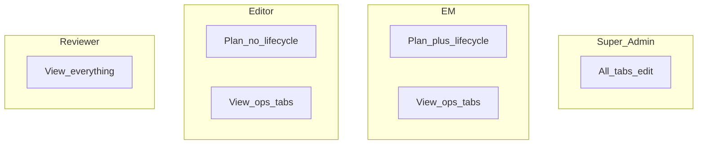
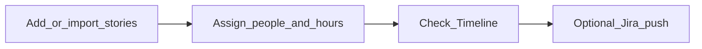

# User guide

How to use Sprint Planner day to day. Technical detail: [ARCHITECTURE.md](ARCHITECTURE.md). Short overview: [README](../README.md). The same content is available in-app under **Help** (`/docs`).

## Sign-in

1. Open the app.
2. Enter your company email and a **Jira personal API token**.
3. If you belong to multiple squads, pick one (editors only see squads where they are Editor).
4. You land on the Dashboard for that squad.

## Roles (what you can do)

| Action | Super Admin | EM | Editor | Reviewer |
| --- | --- | --- | --- | --- |
| Edit stories / hours / assignees | Yes | Yes (squad) | Yes (squad) | No |
| Mark Progress / New Sprint / buffer / move sprint | Yes | Yes | No | No |
| Edit People & Jira / Sprint Settings / users | Yes | No (view) | No (view) | No (view) |
| Switch any squad | Yes | Multi-squad if entitled | Locked to own | Multi-squad if entitled |

**Sprint lifecycle** = Move to next/current sprint, set buffer hours, Mark Progress Now, New Sprint.

## Tabs

### Dashboard (`/`)
Plan the sprint table: story link, BE/FE/Mobile/Integration/QC, PM + buffer, status, release dates, flags, tools (timeline modal, Jira updates).

### Timeline (`/timeline`)
Visual phase schedule for the active board.

### History (`/history`)
Browse archived sprint snapshots.

### People & Jira (`/resources`)
Roster by team (BE/FE/MO/QC/PM/Other Squad). Super admins add people from Jira and edit Jira field connection. Others view.

### Sprint Settings (`/config`)
Sprint start, hours/day, workday start, holidays. Edit: super admin only.

### User Management (`/user-management`)
Squads and user roles. Edit: super admin only. Squad leads only see users in their own squad(s). Super admins can filter the users list by squad.

### Help (`/docs`)
This guide inside the app.

## Recommended workflows

### Plan a sprint (EM / Editor / Super Admin)

1. Confirm sprint window (super admin if it must change).
2. Add tasks or bulk insert / import.
3. Fill hours and assignees; set status.
4. Use Timeline to spot overload.
5. EM/Super Admin: **Mark Progress Now** when you want Cur UAT/Production tracking.
6. Push/pull Jira for linked stories as needed.

### Carry work to next sprint (EM / Super Admin only)

1. Select stories on the Dashboard.
2. Bulk menu → **Move to next sprint** (or back to current).
3. Filter the table by Current / Next sprint views.

### Close / archive

Use History after sprint data is snapshotted via the history APIs / flows your team uses when starting a new sprint (**New Sprint** is EM / Super Admin).

## Dates explained

| Label | Meaning |
| --- | --- |
| Estimated | First frozen release estimate for the story |
| UAT | Tracks after Mark Progress |
| Production | Next business day after UAT |

If stories show **Need remark**, an EM/Super Admin should run **Mark Progress Now** after schedule/hours edits.

## Jira tips

- Story needs a Jira link (or prior sync) for push/pull.
- **Pull from Jira** also adds parent stories under this EM that are not on the dashboard (Engineering Manager field and/or Squad field under People → Jira fields). Those new rows get a **Jira sync** tag.
- Assignees must exist on People with a saved Jira account (mapped at Add time).
- Parent PM/QC custom fields are configured under People → Jira fields (super admin).
- Multiple `[BE]` (or FE/Android/IOS) subtasks under one story are all pulled: hours are summed, every mapped assignee is kept. Push creates one Jira subtask per person.
- Long pull/push result banners **scroll inside** a short box so the dashboard table stays on screen.

## Appearance

The app follows the laptop **light / dark** theme so labels, tables, and inputs stay readable on dark-mode machines.
